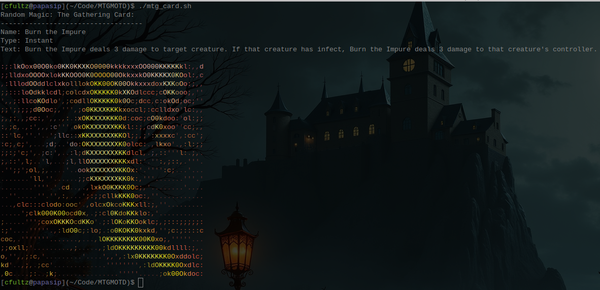

# Random MTG Card for SSH MOTD

- Save the script somewhere
- Add that script to your ``.bashrc`` or ``.bash_profile`` at the end of the file (ex: ``~/mtg_card.sh``)
- Source your ``.bashrc``
- There. You have a random card.

